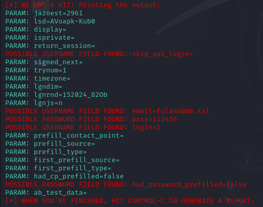

# **Cibersecurity - Desafio Phishing**

Bem-vindo ao repositório **cibersecurity-desafio-phishing** !

---

### **Descrição**  
Este projeto visa proporcionar um ambiente de aprendizado seguro, onde qualquer pessoa pode entender e praticar técnicas básicas de phishing, sem riscos reais. Vamos focar na criação de ataques simulados e ensinar como identificar e prevenir ataques reais de engenharia social.

---

## **Ferramenta Usada**  
O **Social Engineering Toolkit (SET)** é uma poderosa ferramenta integrada no Kali Linux, projetada para realizar ataques de engenharia social. Neste repositório, utilizaremos o **Site Cloner** para simular a clonagem de páginas e phishing.

---

## **Passos para Usar o Site Cloner**  
1. **Início do Toolkit**: No terminal do Kali logado como root, execute o SET com o seguinte comando:
   ```bash
   setoolkit
   ```
2. **Escolha o tipo de ataque**:
   - Digite `2` para **Social-Engineering Attacks**.
   - Digite `3` para **Web Site Attack Vectors**.
   - Digite `1` para **Credential Harvester Attack Method**.
   - Digite `1` novamente para **Site Cloner**.

3. **Informe a URL do site que deseja clonar**:
   - Coloque `http://www.facebook.com` para clonar o Facebook.
   
4. **Evite problemas de segurança**:
   - **REMOVA referências a arquivos externos **`src`** usando o comando**: 
     ```bash
     sed -i '/"src":/d' /root/.set/web_clone/index.html
     ```
5. **Resultado**:



---

### **Segurança ao Realizar Ataques de Phishing**  
- **Evite o uso malicioso**: Este projeto é para aprendizado e deve ser usado apenas para fins educacionais.

---

## Como Verificar Links Suspeitos

### Antes de Clicar em Links

1. **Analise o URL**
   - Verifique erros de digitação (exemplo: amaz0n.com, faceb00k.com)
   - Confira se o domínio é legítimo
   - Atenção a subdomínios suspeitos (exemplo: facebook.phishing-site.com)

2. **Dicas Práticas**
   - Passe o mouse sobre o link (não clique) para ver o destino real
   - Copie o link e analise-o nos verificadores Online abaixo
   - Se recebeu por SMS/WhatsApp, confirme com o remetente por outro canal

3. **Use Verificadores Online de URL**
   - VirusTotal (www.virustotal.com)
   [VirusTotal URL Scanner](https://www.virustotal.com/gui/home/url)
   - Google Safe Browsing (transparencyreport.google.com/safe-browsing)
   [Google Safe Browsing](https://transparencyreport.google.com/safe-browsing/search)
   - URLVoid (www.urlvoid.com)
   [URLVoid](https://www.urlvoid.com/)